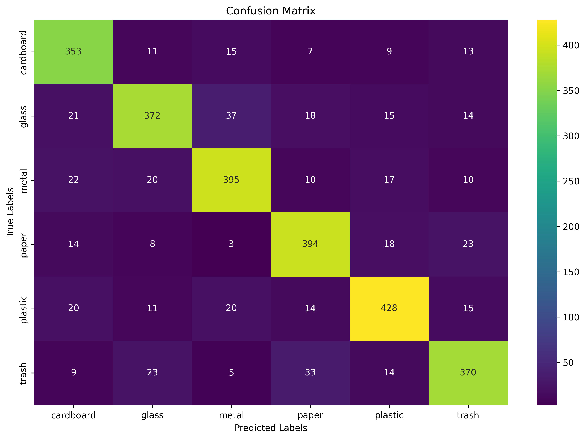

# Garbage Classification 
- Rust CNNA high-performance Convolutional Neural Network (CNN) for garbage classification built from scratch using **Rust** and the **tch** crate (PyTorch bindings).
- This project classifies waste into 6 categories: cardboard, glass, metal, paper, plastic, and trash with **82.24% validation accuracy on unseen dataset** or more depending on how much you train it.

## 🎯 Project Overview- **Language**: Rust with tch (PyTorch C++ API bindings)
- **Model**: Custom CNN with batch normalization, dropout, and data augmentation
- **Classes**: 6 garbage types (cardboard, glass, metal, paper, plastic, trash)
- **Dataset Size**: 13,901 images
- **Performance**: 82.24% validation accuracy
- **Training Platform**: Kaggle GPUs

## 📊 Dataset**Source**: [Garbage Classification Dataset on Kaggle](https://www.kaggle.com/datasets/zlatan599/garbage-dataset-classification)

- **Total Images**: 13,901
- **Training Set**: 11,120 images (80%)
- **Validation Set**: 2,781 images (20%)
- **Image Size**: 200x200 RGB
- **Data Augmentation**: Random horizontal/vertical flips, rotation, resizing

## 🚀 Features

### Model Architecture
- **Feature Extraction**: 5 convolutional blocks with increasing channels (32→64→128→256→512)
- **Pooling**: Max Pooling and Adaptive Average Pooling to capture spatial features
- **Classification**: Multi-layer fully connected layers with dropout (0.15 and 0.075) for regularization
- **Regularization**: Batch normalization, gradient clipping to prevent exploding gradients

### Training Features
- **Hybrid Learning Rate Scheduling**: Combines warmup, cosine annealing, and step decay for adaptive learning rate tuning
- **Early Stopping**: Validation-based configurable patience to stop training when no improvement is observed
- **Optimizer**: Adam optimizer with weight decay and epsilon tuning for stable convergence
- **Loss Function**: Cross-entropy with optional label smoothing (configurable)
- **Batch Size**: 32 (configurable per training session)
- **Device Support**: Automatic CUDA GPU detection with fallback to CPU
- **Gradient Clipping**: Clips gradients with max norm to maintain training stability
- **Multiple Model Saving Formats**: PyTorch native, named tensor format, individual tensor files, and JSON metadata for universal compatibility
- **Interactive Model Testing**: Command-line interface for manual image testing during development
- **Training Statistics Export**: Epoch-wise metrics saved in CSV for analysis and visualization

### Evaluation & Visualization
- **Comprehensive Metrics**: Precision, recall, F1-score, and support per class
- **Confusion Matrix**: Detailed misclassification analysis and CSV export
- **Loss Curves**: Training and validation loss tracking included
- **Export**: CSV files and Python plotting scripts for detailed metric visualization

## ⚙️ Installation & Setup### Prerequisites```bash
# Install Rust (if not already installed)

```bash
curl --proto '=https' --tlsv1.2 -sSf https://sh.rustup.rs | sh
source ~/.cargo/env
```

### LibTorch Setup**For CPU-only (Linux):**
```bash
curl -O https://download.pytorch.org/libtorch/cpu/libtorch-cxx11-abi-shared-with-deps-2.1.0%2Bcpu.zip
```

**For GPU (Linux) with CUDA 12.1:**
```bash
curl -O https://download.pytorch.org/libtorch/cu121/libtorch-cxx11-abi-shared-with-deps-2.1.0%2Bcu121.zip
```
-unzip the zips

### Environment Variables (edit it to the right path)
```bash
export LIBTORCH=/path/to/libtorch
export LD_LIBRARY_PATH=$LIBTORCH/lib:$LD_LIBRARY_PATH
```
***

## 📈 Results

### Performance Metrics

- **Overall Accuracy**: 83.35% (validation, best epoch: 52)
- **Training Time**: ~1 hour 3 minutes (57 epochs, early stopping, GPU)
- **Final Training Loss**: 0.0394
- **Final Validation Loss**: 0.7798

### Per-Class Performance

| Class     | Precision | Recall | F1-Score | Support |
|-----------|-----------|--------|----------|---------|
| Cardboard | 0.80      | 0.87   | 0.83     | 408     |
| Glass     | 0.84      | 0.78   | 0.81     | 477     |
| Metal     | 0.83      | 0.83   | 0.83     | 474     |
| Paper     | 0.83      | 0.86   | 0.84     | 460     |
| Plastic   | 0.85      | 0.84   | 0.85     | 508     |
| Trash     | 0.83      | 0.81   | 0.82     | 454     |

**Weighted Avg:** P=0.83, R=0.83, F1=0.83 (all classes, support=2781)

***

- **Confusion matrix and more are available in `confusion_matrix.csv`, `evaluation_results.csv`.**
- **For learning curves, see the included plot script output.**
- **Model formats:** PyTorch `.pt`, named tensors, individual tensors, JSON metadata.

***

### Key Insights- **Best Performance**: Cardboard and Metal classification
- **Challenge Areas**: Glass classification (visually similar to other materials)
- **Common Confusions**: Glass ↔ Paper/Plastic (expected due to visual similarity)
- **Learning Curve**: Smooth convergence without overfitting





## 🌐 Kaggle Integration**Live Demo**: [Garbage Classifier Rust on Kaggle](https://www.kaggle.com/code/aarymilindkinge/garbage-classifier-rust)

This project was developed and tested on **Kaggle Notebooks** using free GPU access, demonstrating the feasibility of Rust-based deep learning on cloud platforms.

### Kaggle Mock Setup
Check out this [link](https://www.kaggle.com/code/aarymilindkinge/garbage-classifier-rust) look for full example
```bash
# Clone repository
!git clone https://github.com/Not-Buddy/garbage_classification.git
%cd garbage_classification

# Install Rust + dependencies (handled in notebook)
# Run training
!cargo run --release -- 3
```
```
## 📁 Project Structure```
garbage_classification/
├── src/
│   ├── main.rs                 # Entry```int with CLI argument```rsing
│   ├── menu.rs                 # Configuration```nagement +```taset loading
│   ├── relu.rs                 # CNN```del architecture
│   ├── train_model.rs          # Training```op and optimization
│   ├── training_validation.rs  # Evaluation metrics an```lotting
│   └── visualize_data.rs       # Data loading and batch```sualization
├── Cargo.toml                  # Dependencies and project configuration
├── README.md                   # This file
└── plot_results.py             # Generated Python plotting script
```

## 🔧 Technical Implementation### Dataset Loading- **Parallel Processing**: Rayon for multi-threaded image loading
- **Augmentation Pipeline**: Random flips, rotation, resizing
- **Memory Efficiency**: Tensor operations in CHW format
- **Progress Tracking**: Real-time processing counter

### Model Architecture
```rust
CNN {
    features: Conv2d(32) -> BN -> ReLU -> Conv2d(32) -> BN -> ReLU -> MaxPool
              Conv2d(64) -> BN -> ReLU -> Conv2d(64) -> BN -> ReLU -> MaxPool  
              Conv2d(128) -> BN -> ReLU -> Conv2d(128) -> BN -> ReLU -> MaxPool,
    
    gap: GlobalAveragePooling2d,
    
    classifier: Linear(128) -> ReLU -> Dropout(0.15) -> Linear(6)
}
```

### Training Features

- **Hybrid Learning Rate Scheduling**: Combines warmup, cosine annealing, and step decay for smooth and adaptive learning rate adjustment
- **Early Stopping**: Validation-based early stopping with configurable patience and minimum improvement thresholds to prevent overfitting
- **Gradient Clipping**: Stable training by clipping gradients with max norm to prevent exploding gradients
- **Multiple Model Saving Formats**: Saves models in PyTorch native, named tensor, individual tensor, and metadata JSON formats for maximum usability and interoperability
- **Automatic Device Selection**: GPU-enabled training with fallback to CPU for seamless cross-platform compatibility
- **Progress Monitoring**: Real-time logging of training/validation losses, accuracies, and learning rates with epoch-wise summaries
- **Comprehensive Evaluation**: Detailed per-class precision, recall, F1-score, confusion matrix generation, and CSV export for analysis
- **Interactive Model Testing**: Manual image classification interface for fast inference and validation during development
- **Efficient Data Loading**: Custom DataLoader with batch handling and image preprocessing aligned with training specs
- **Training Statistics Export**: Saves complete training metrics in CSV supporting downstream visualization and analysis


## 📊 Generated Outputs

After training, the following files are automatically generated:

- `training_losses.csv` - Loss data for plotting training progress
- `confusion_matrix.csv` - Confusion matrix data for classification analysis
- `evaluation_results.csv` - Detailed predictions with probabilities for each validation sample
- `training_stats.csv` - Complete training metrics including losses and accuracies per epoch
- `plot_results.py` - Python script for generating performance plots and visualizations
- `garbage_classifier_100_epochs_13901_samples.pt` - Saved PyTorch model weights in universal format
- `garbage_classifier_100_epochs_13901_samples_named.pt` - Named tensors format for Python compatibility
- `garbage_classifier_100_epochs_13901_samples_tensors/` - Directory containing individual tensor files
- `garbage_classifier_100_epochs_13901_samples_metadata.json` - JSON metadata file with training and model details

---

### Usage Notes

- Use `plot_results.py` to generate insightful visualizations of training progress, losses, and metrics:

## 🔄 Future Improvements
### Model Enhancements- **Transfer Learning**: ResNet/EfficientNet backbones
- **Attention Mechanisms**: Focus on distinguishing features
- **Ensemble Methods**: Multiple model voting
- **Advanced Augmentation**: MixUp, CutMix, AutoAugment

### Engineering
- **Early Stopping**: Automatic best model selection
- **Hyperparameter Tuning**: Automated search
- **Model Serving**: REST API for inference
- **Cross-Validation**: More robust evaluation

## 🏆 Why Rust?
- **Performance**: Near-C++ speed with memory safety
- **Concurrency**: Excellent parallel processing support
- **Ecosystem**: Growing ML/DL ecosystem with tch
- **Deployment**: Single binary, no runtime dependencies
- **Reliability**: Compile-time guarantees prevent common ML bugs

## 🤝 Contributing1. Fork the repository
2. Create your feature branch (`git checkout -b feature/amazing-feature`)
3. Commit your changes (`git commit -m 'Add amazing feature'`)
4. Push to the branch (`git push origin feature/amazing-feature`)
5. Open a Pull Request

## 📄 LicenseThis project is open source and available under the [MIT License](LICENSE).

## 🙏 Acknowledgments- [tch crate](https://crates.io/crates/tch) for PyTorch bindings
- [Kaggle](https://kaggle.com) for free GPU access
- Dataset contributors for the garbage classification dataset
- Rust community for excellent documentation and support

***

**⭐ Star this repository if you found it helpful!**

For questions or collaboration opportunities, feel free to open an issue or reach out directly.

[1](https://www.kaggle.com/code/aarymilindkinge/garbage-classifier-rust)
